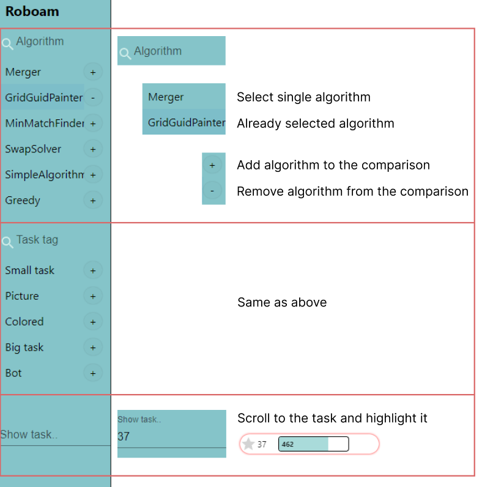
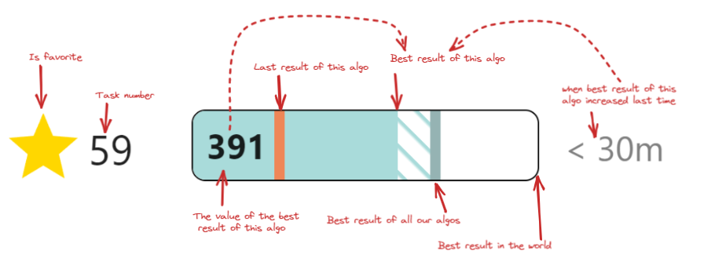
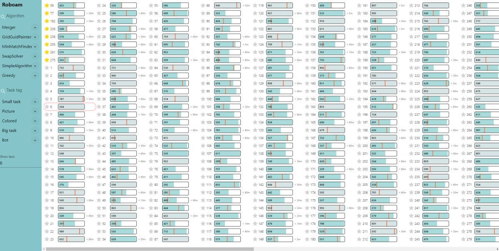
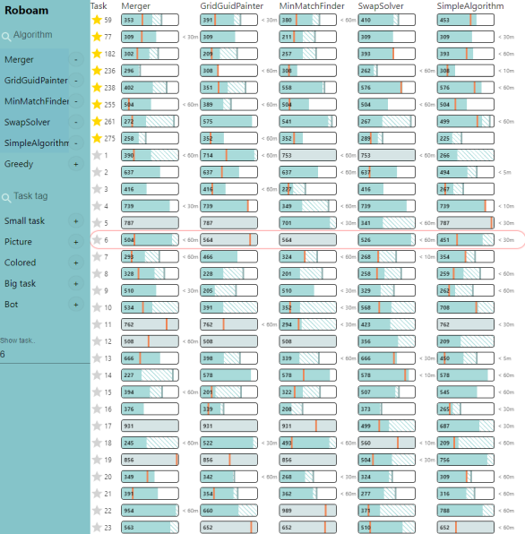

# Roboam.UI

## Terminology
#### Task
A set of conditions that need to be solved. The task has its own number.

#### Algorithm
An entity that receives a set of conditions and outputs a final result that receives a certain score

#### Tag
A formal description of the task. (for example: color, data composition)

## Navigation

## Legend

#### Last result of this algo
The result of the last value sent. It is shown only if there is less than the best result of this algo.
Allows you to clearly see which tasks have become worse to solve and by how much.

#### Best result of this algo
The best result achieved by the algorithm.

#### Best result of all our algos
The best result achieved by our algorithms. It is shown only if there is more than the best result of this algo.
Allows you to clearly see how much is mussing to the best result of our algorithms.

#### Best result in the world
The best result achieved in the world. It is shown only if we can get that value.
Otherwise, by default is will be our best result of all our algorithms.

#### Algo increased last time
Allows you to clearly see which algorithms have achieved improvements, has several states ('now', '< 5m', '< 10m', '< 30m', '< 60m')

## Features

Monitoring allows you to quickly track a large number of tasks (using virtualization) and compare algorithms with each other. 
Also, you can find a specific task and track a list of favorite tasks. 

#### Dashboard mode

#### Comparison mode

